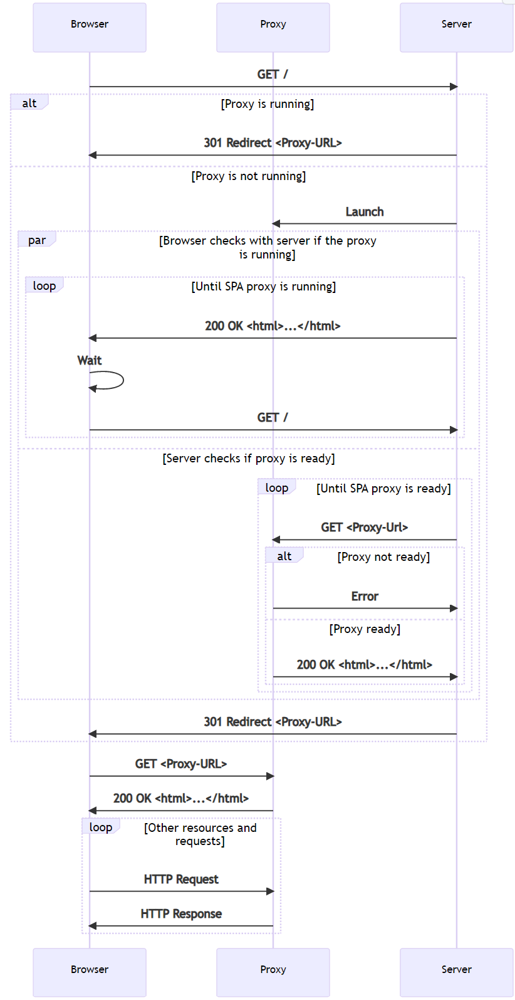
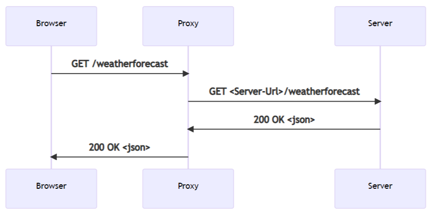

# Overview of SPA in ASP.NET Core

Source: https://learn.microsoft.com/en-us/aspnet/core/client-side/spa/intro?view=aspnetcore-7.0

## Architecture of Single Page Application templates

The Single Page Application (SPA) templates for [Angular](./Angular.md) and [React](./React.md) offer the ability to develop Angular and React apps that are hosted inside a .NET backend server.

At publish time, the files of the Angular and React app are copied to the wwwroot folder and are served via the static files middleware.

```csharp
app.UseStaticFiles();

app.MapFallbackToFile("index.html");
```

Rather than returning HTTP 404 (Not Found), a fallback route handles unknown requests to the backend and serves the index.html for the SPA.

During development, the app is configured to use the frontend proxy. React and Angular use the same frontend proxy.

When the app launches, the index.html page is opened in the browser. A special middleware that is only enabled in development:

1. Intercepts the incoming requests.
2. Checks whether the proxy is running.
3. Redirects to the URL for the proxy if it's running or launches a new instance of the proxy.
4. Returns a page to the browser that auto refreshes every few seconds until the proxy is up and the browser is redirected.



The primary benefit the ASP.NET Core SPA templates provide:

- Launches a proxy if it's not already running.
- Setting up HTTPS.
- Configuring some requests to be proxied to the backend ASP.NET Core server.

When the browser sends a request for a backend endpoint, for example `/weatherforecast` in the templates. The SPA proxy receives the request and sends it back to the server transparently. The server responds and the SPA proxy sends the request back to the browser:

