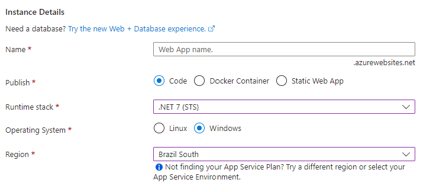
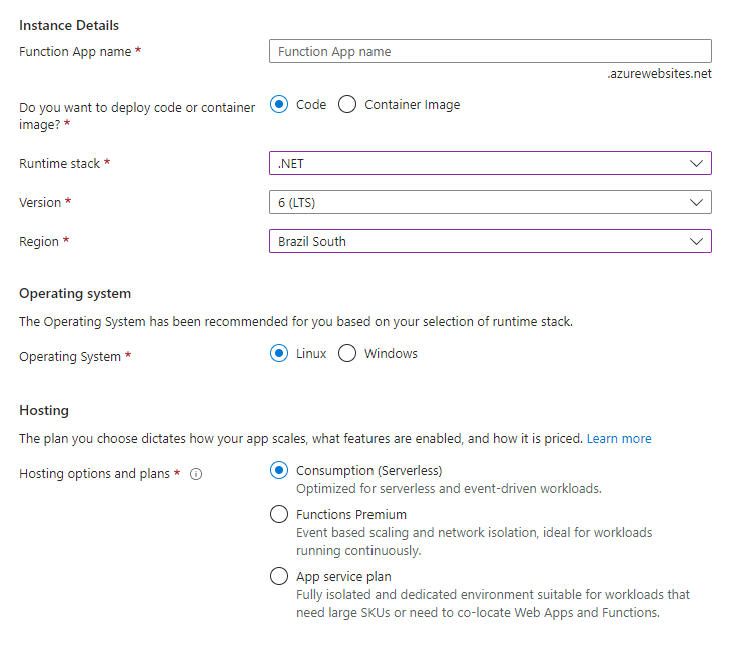
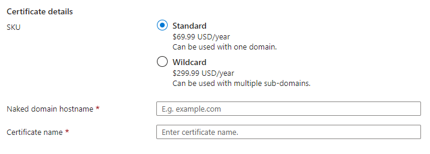
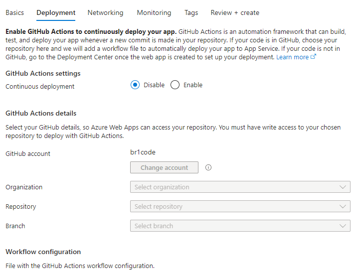
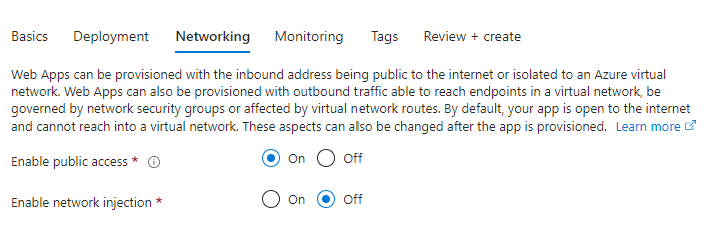
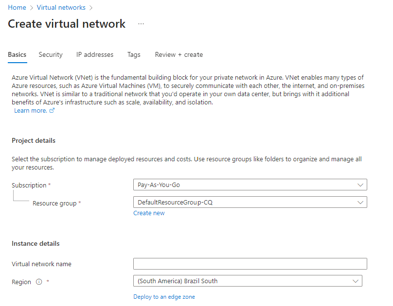
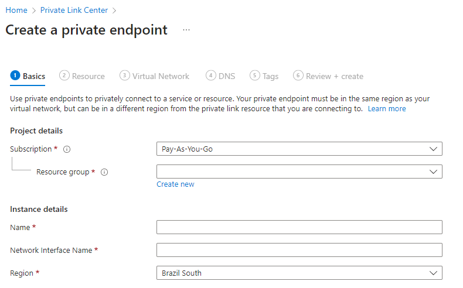
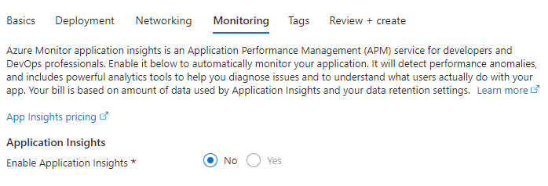
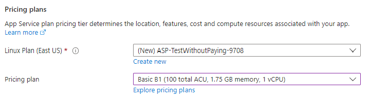

# Azure App Services

Azure App Service is a fully managed platform for building, deploying, and scaling web apps. It simplifies the process of creating and managing web applications and APIs, allowing you to focus on your application logic rather than infrastructure. Here's a comprehensive overview:

## Definition

Azure App Service is a Platform as a Service (PaaS) offering that supports various application types, such as web apps, mobile app backends, RESTful APIs, and serverless functions. It provides built-in features like autoscaling, custom domains, SSL certificates, and continuous deployment, making it an ideal choice for developers looking to deploy web applications and APIs quickly and easily.

## App Types

Azure App Service supports several app types, including:

- Web Apps: Host web applications and static websites built with various programming languages and frameworks (e.g., .NET, Node.js, Python, Java, PHP).
- API Apps: Host and manage RESTful APIs with built-in support for API definition (Swagger/OpenAPI) and client code generation.
- Mobile Apps: Backend services for mobile applications, including data storage, authentication, and push notifications.
- Logic Apps: Design and run serverless workflows that integrate with various services and APIs.

- Function Apps: Host and manage serverless functions that respond to events or triggers.

## Deployment Slots

Deployment slots are live instances of your app with their own hostnames, allowing you to test and stage new versions of your app before promoting them to production. You can easily swap the content between slots, minimizing downtime and ensuring seamless updates.

## Custom Domains and SSL

Azure App Service supports custom domain names and SSL certificates for your apps. You can either purchase an SSL certificate through Azure or import your own.

## Scaling

Azure App Service offers both vertical and horizontal scaling options. You can scale up to increase the resources available to your app, or scale out to distribute the load across multiple instances.

## Continuous Deployment

Azure App Service integrates with various source control systems like GitHub, Bitbucket, and Azure Repos for continuous deployment. You can configure your app to automatically deploy changes from your chosen source control repository.

## Networking

App Service supports integration with Azure Virtual Networks (VNet) using VNet integration or Azure Private Endpoint, allowing your apps to securely access resources within your virtual network.

## Monitoring and Diagnostics

Azure App Service provides built-in monitoring and diagnostics capabilities, such as log streaming, remote debugging, and integration with Azure Monitor.

## Security

App Service supports a variety of security features, including authentication and authorization using Azure Active Directory (AAD), social media logins, and multi-factor authentication (MFA). It also integrates with Azure Security Center for advanced threat protection and vulnerability management.

## App Service Plans

Azure App Service is billed based on the App Service Plan, which determines the resources, features, and scaling options available to your apps. There are several plans to choose from, including a free tier with basic features and limited resources, as well as premium tiers that offer more resources, features, and scalability.

## Best Practices

- Choose the appropriate App Service Plan based on your app's requirements and budget.
- Use deployment slots for testing and staging new app versions.
- Configure custom domains and SSL certificates for a professional appearance and secure communication.
- Implement autoscaling to handle variable workloads and optimize costs.
- Monitor your app's performance and usage with Azure Monitor and built-in diagnostics tools.

Understanding Azure App Service will enable you to quickly and efficiently build, deploy, and manage web apps, APIs, and serverless functions on Azure. Make sure to explore the official Azure documentation for more information and use cases.