# Azure Virtual Machines

**TODO: Create a small VM and add screenshots of the result.**

Azure Virtual Machines (VMs) are a foundational service in Azure that allows you to run applications on virtualized infrastructure. Here's a comprehensive overview:

## Definition

Azure Virtual Machines are on-demand, scalable compute resources that enable you to deploy and manage applications on the Azure cloud platform. VMs provide you with full control over the underlying operating system and software stack, making them suitable for a wide range of applications and scenarios.

Steps:

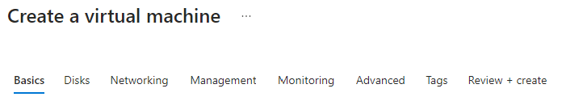

Basics:

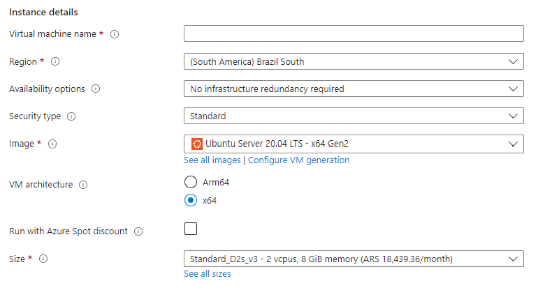

## VM Sizes and Families

Azure offers a variety of VM sizes and families, optimized for different workloads and performance requirements. Some examples include:
   - General Purpose: Balanced CPU-to-memory ratio (e.g., B, D, and Ds series)
   - Compute Optimized: High CPU-to-memory ratio (e.g., F and Fs series)
   - Memory Optimized: High memory-to-CPU ratio (e.g., E and M series)
   - Storage Optimized: High disk throughput and IO (e.g., L series)
   - GPU Optimized: GPU capabilities for graphics and compute workloads (e.g., N series)

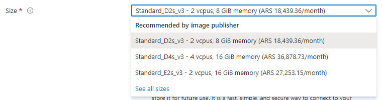

## Operating Systems

Azure supports a wide range of operating systems, including various Linux distributions (e.g., Ubuntu, CentOS, and Red Hat) and Windows Server versions. You can choose from pre-configured images available in the Azure Marketplace or upload your own custom images.

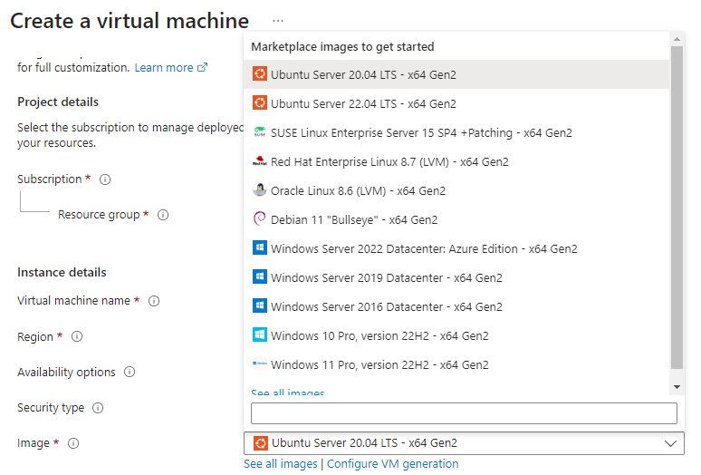

## VM Disks

Azure VMs use two types of disks:
   - OS Disk: Contains the operating system and is created from an image. By default, it's a managed disk with a size of 128 GB (can be expanded).
   - Data Disks: Optional disks that can be attached to VMs for storing application data. You can choose between Standard HDD, Standard SSD, and Premium SSD based on performance requirements.

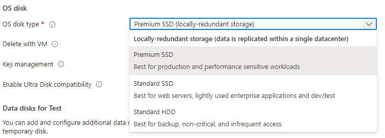

## Networking

VMs are automatically connected to a virtual network (VNet) and can communicate with other resources within the same VNet. You can configure network settings like public IP addresses, network security groups (NSGs), and load balancers to control access and distribute traffic to your VMs.

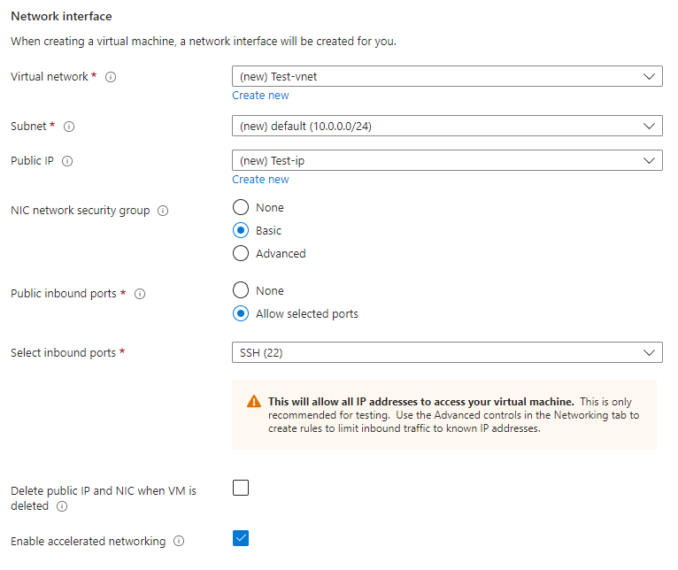
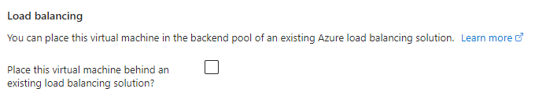

## High Availability and Resiliency

To ensure high availability and fault tolerance, you can deploy VMs across Availability Zones, Availability Sets, or use VM Scale Sets. You can also configure VMs with Azure Backup and Azure Site Recovery for data protection and disaster recovery.

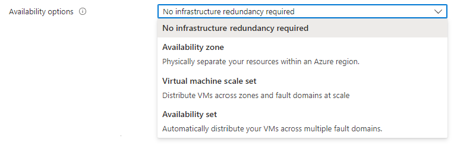

## VM Extensions

VM extensions are small applications that provide post-deployment configuration and management tasks, such as installing software, configuring settings, or running scripts. Examples include the Custom Script Extension, PowerShell Desired State Configuration (DSC) Extension, and Microsoft Antimalware Extension.

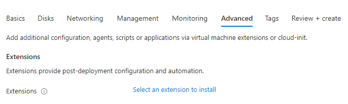

## Management and Monitoring

Azure provides various tools to manage and monitor VMs, such as the Azure portal, Azure PowerShell, Azure CLI, and Azure Resource Manager (ARM) templates. You can also use Azure Monitor to collect and analyze performance metrics, logs, and diagnostic data.

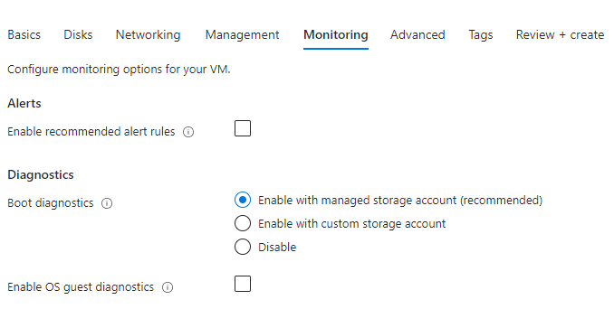

## Security and Compliance

Azure VMs can be secured using various features like Azure Active Directory (AAD) integration, Azure Security Center, Azure Disk Encryption, and Azure Private Link. Additionally, Azure VMs are compliant with various industry standards and regulations.

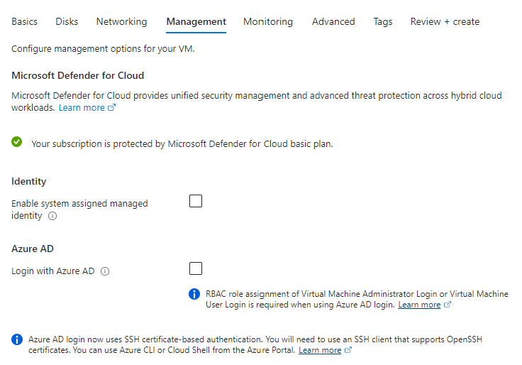

## Cost Optimization

You can optimize VM costs by choosing the right VM size, using reserved instances, leveraging Azure Hybrid Benefit, and implementing auto-shutdown and scale-out policies.

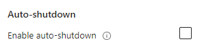

## Best Practices

- Choose the appropriate VM size and family based on your workload requirements.
- Use managed disks for better reliability and performance.
- Implement high availability and resiliency using Availability Zones, Availability Sets, or VM Scale Sets.
- Secure your VMs using Azure Security Center, disk encryption, and network security groups.
- Monitor and manage your VMs using Azure Monitor and other management tools.