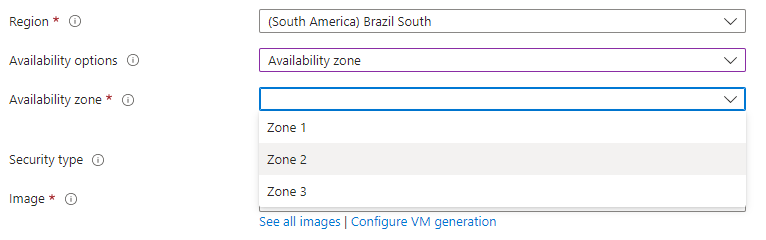

# Availability Zones

Availability Zones are a key concept in Azure that helps ensure high availability and fault tolerance for your applications. Here's a comprehensive overview:

## Definition

Availability Zones are physically separate locations within an Azure region, each containing one or more data centers. They provide redundancy and fault tolerance by isolating failures within a single zone, while enabling applications to distribute their resources across multiple zones.

## Fault Isolation

Each Availability Zone is designed to be independent, with its own power, cooling, and networking infrastructure. This protects your applications and data from data center-level failures, such as power outages, hardware issues, or network disruptions.

## Low Latency Network Connectivity

Availability Zones are connected by a high-speed, low-latency private network, ensuring fast and reliable communication between zones. This enables applications to synchronize data and maintain consistency across zones.

## Zone Redundant Services

Some Azure services, such as Azure SQL Database and Azure Cosmos DB, offer zone-redundant configurations that automatically replicate data and resources across Availability Zones. This ensures high availability and fault tolerance without requiring manual configuration.

## Zone-Pinned Services

For services that don't support zone redundancy, you can choose to deploy resources in specific Availability Zones to achieve the desired level of redundancy and fault tolerance. For example, you can create Virtual Machines or Managed Disks in different zones.

## Load Balancing across Zones

You can use Azure Load Balancer or Azure Traffic Manager to distribute traffic across resources in multiple Availability Zones, ensuring that your application remains responsive and available even if one zone experiences issues.

## Service Level Agreement (SLA)

Azure provides a higher SLA for services deployed across multiple Availability Zones. For example, VMs deployed across at least two Availability Zones within the same region have a 99.99% SLA, compared to 99.95% for a single instance.

## Costs

Using multiple Availability Zones may increase the cost of your resources, as data transfer between zones is billed. However, this can be offset by the increased reliability and reduced downtime of your application.

## Supported Regions

Not all Azure regions support Availability Zones. You can refer to the Azure documentation to check which regions have Availability Zones: https://docs.microsoft.com/en-us/azure/availability-zones/az-region

## Best Practices

- Use a combination of zone-redundant and zone-pinned resources for optimal fault tolerance.
- Implement load balancing to distribute traffic across zones.
- Design your application to handle zone-level failures gracefully, such as retrying failed requests or switching to a secondary zone.
- Monitor the health and performance of your resources across zones using Azure Monitor.

Understanding Availability Zones is crucial for designing and deploying highly available and fault-tolerant applications on Azure. Make sure to refer to the official Azure documentation and incorporate Availability Zones into your application architecture as needed.