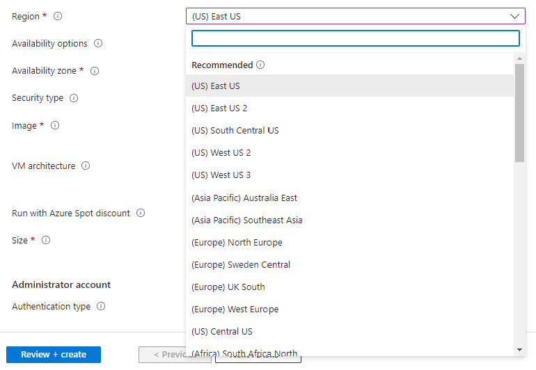

# Azure Regions

Azure Regions are a fundamental concept in Azure that impacts the performance, availability, and compliance of your applications. Here's a comprehensive overview:

## Definition

Azure Regions are geographical areas that host one or more Azure data centers. They are the primary unit for organizing and deploying Azure resources, and they enable you to select locations that best meet your application's requirements for latency, data sovereignty, and compliance.

## Data Centers

Each Azure Region consists of multiple data centers that provide compute, storage, and networking resources for your applications. Data centers within a region are interconnected by a high-speed, low-latency network to ensure fast and reliable communication between resources.

## Region Pairs

Azure Regions are organized into pairs to provide additional redundancy and failover options. In the event of a regional disaster, Azure automatically fails over to the paired region, ensuring continued availability of your resources. Paired regions are always located within the same geopolitical boundary (e.g., the United States, Europe, or Asia).

## Latency

The proximity of an Azure Region to your users impacts the latency of your application. Deploying your resources in a region closer to your users can reduce latency and improve the overall user experience.

## Data Sovereignty and Compliance

Certain industries and countries have regulations that require data to be stored and processed within specific geographical boundaries. By selecting the appropriate Azure Region, you can ensure that your application complies with these requirements.

## Available Services

Not all Azure services are available in every region. You should consult the Azure documentation to determine which services are available in the regions you plan to use: https://azure.microsoft.com/en-us/global-infrastructure/services/

## Service Level Agreement (SLA)

Azure provides different SLAs for services based on their deployment configurations. Deploying resources across multiple regions can help you achieve higher SLAs and ensure the availability of your application in the event of a regional outage.

## Costs

Resource costs can vary between Azure Regions due to differences in infrastructure, local regulations, and demand. When selecting a region, consider the cost implications in addition to performance, availability, and compliance requirements.

## Traffic Routing

You can use Azure Traffic Manager or Azure Front Door to route traffic to your resources in multiple regions, allowing you to serve users from the region that provides the best performance and availability.

## Data Replication

Azure provides various options for replicating data across regions, such as Azure Storage Service's geo-redundant storage (GRS) and Azure SQL Database's active geo-replication. This helps ensure high availability and disaster recovery.

## Best Practices

- Choose Azure Regions based on factors like latency, data sovereignty, and compliance requirements.
- Deploy resources across multiple regions to ensure high availability and disaster recovery.
- Monitor resource performance and costs across regions using Azure Monitor and Azure Cost Management.
- Use traffic routing services like Azure Traffic Manager or Azure Front Door to optimize user experience.

Understanding Azure Regions is essential for designing and deploying applications that meet performance, availability, and compliance requirements. Make sure to refer to the official Azure documentation and incorporate Azure Regions into your application architecture as needed.