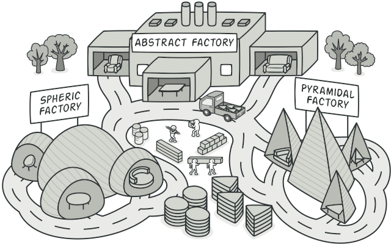

# Abstract Factory



## Simple Explanation

The Abstract Factory design pattern is a creational design pattern that provides an interface for creating families of related or dependent objects without specifying their concrete classes. It promotes loose coupling between classes by delegating object creation to factory objects instead of using direct instantiation.

## Deep Explanation

The Abstract Factory pattern involves four main components:

1. Abstract Factory - an interface or abstract class that declares methods for creating related or dependent objects.

2. Concrete Factory - a class that implements the Abstract Factory interface, creating and returning concrete objects of a specific family.

3. Abstract Product - an interface or abstract class that defines a common interface for a family of objects the factory methods create. Concrete Product classes implement this interface.

4. Concrete Product - a class that implements the Abstract Product interface, providing a specific implementation for a product in a family.

By implementing the Abstract Factory pattern, you can create a flexible and modular system that allows clients to work with different families of related objects without specifying their concrete classes. This promotes loose coupling and improves code maintainability.

## Examples

Let's imagine we have a simple application that creates and processes different types of user interfaces (UI) for different platforms.

1. Create the Abstract Product interfaces:

```C#
public interface IButton
{
    void Click();
}

public interface ITextBox
{
    void EnterText(string text);
}
```

2. Implement Concrete Product classes:

```C#
public class WindowsButton : IButton
{
    public void Click()
    {
        Console.WriteLine("Clicked a Windows button.");
    }
}

public class MacButton : IButton
{
    public void Click()
    {
        Console.WriteLine("Clicked a Mac button.");
    }
}

public class WindowsTextBox : ITextBox
{
    public void EnterText(string text)
    {
        Console.WriteLine($"Entered text '{text}' in a Windows text box.");
    }
}

public class MacTextBox : ITextBox
{
    public void EnterText(string text)
    {
        Console.WriteLine($"Entered text '{text}' in a Mac text box.");
    }
}
```

3. Create the Abstract Factory interface:

```C#
public interface IUIFactory
{
    IButton CreateButton();
    ITextBox CreateTextBox();
}
```

4. Implement Concrete Factory classes:

```C#
public class WindowsUIFactory : IUIFactory
{
    public IButton CreateButton()
    {
        return new WindowsButton();
    }

    public ITextBox CreateTextBox()
    {
        return new WindowsTextBox();
    }
}

public class MacUIFactory : IUIFactory
{
    public IButton CreateButton()
    {
        return new MacButton();
    }

    public ITextBox CreateTextBox()
    {
        return new MacTextBox();
    }
}
```

5. Use the Abstract Factory:

```C#
class Program
{
    static void Main(string[] args)
    {
        IUIFactory factory;

        if (RuntimeInformation.IsOSPlatform(OSPlatform.Windows))
        {
            factory = new WindowsUIFactory();
        }
        else
        {
            factory = new MacUIFactory();
        }

        IButton button = factory.CreateButton();
        button.Click();

        ITextBox textBox = factory.CreateTextBox();
        textBox.EnterText("Hello, world!");
    }
}
```

In this example, `IButton` and `ITextBox` are Abstract Product interfaces, `WindowsButton`, `MacButton`, `WindowsTextBox`, and `MacTextBox` are Concrete Product classes, `IUIFactory` is the Abstract Factory interface, and `WindowsUIFactory` and `MacUIFactory` are Concrete Factory classes.

The `IUIFactory` interface declares methods for creating related UI objects, and the concrete factory classes implement these