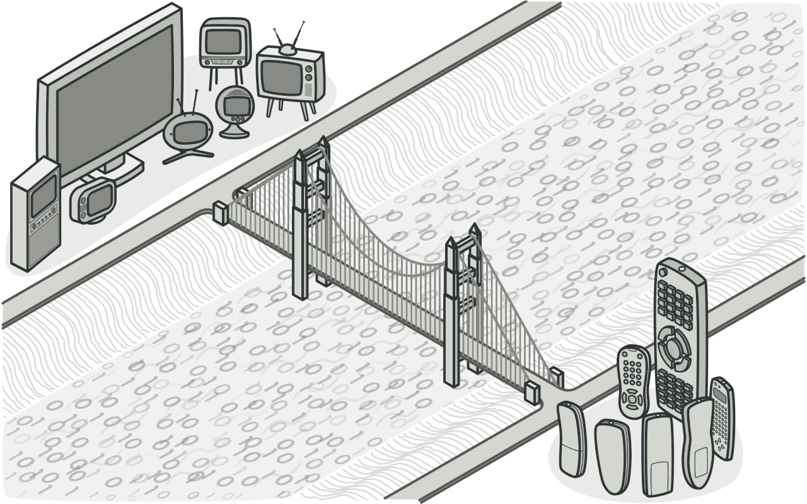

# Bridge



## Simple Explanation

The Bridge design pattern is a structural pattern that decouples an abstraction from its implementation, allowing them to vary independently. This pattern promotes flexibility by reducing tight coupling between the abstraction and the implementation, making it easier to swap out implementations without affecting the abstraction.

## Deep Explanation

The Bridge pattern involves four main components:

1. Abstraction - defines the high-level interface that the client uses.

2. RefinedAbstraction - extends the Abstraction with more specific functionality.

3. Implementor - defines the interface for the implementation classes.

4. ConcreteImplementor - implements the Implementor interface and provides the actual implementation.

The Bridge pattern separates the Abstraction and the Implementor into two separate class hierarchies, so they can be changed independently. The Abstraction contains a reference to the Implementor, and the client interacts with the Abstraction, which delegates the calls to the Implementor.

## Examples

Let's imagine we have a simple application for managing and drawing shapes with different rendering methods (e.g., vector or raster).

1. Create the Implementor interface:

```C#
public interface IRenderer
{
    void RenderShape(string shape);
}
```

2. Implement ConcreteImplementor classes:

```C#
public class VectorRenderer : IRenderer
{
    public void RenderShape(string shape)
    {
        Console.WriteLine($"Drawing {shape} as lines and curves.");
    }
}

public class RasterRenderer : IRenderer
{
    public void RenderShape(string shape)
    {
        Console.WriteLine($"Drawing {shape} as pixels.");
    }
}
```

3. Create the Abstraction class:

```C#
public abstract class Shape
{
    protected IRenderer Renderer;

    protected Shape(IRenderer renderer)
    {
        Renderer = renderer;
    }

    public abstract void Draw();
}
```

4. Implement RefinedAbstraction classes:

```C#
public class Circle : Shape
{
    public Circle(IRenderer renderer) : base(renderer) { }

    public override void Draw()
    {
        Renderer.RenderShape("circle");
    }
}

public class Rectangle : Shape
{
    public Rectangle(IRenderer renderer) : base(renderer) { }

    public override void Draw()
    {
        Renderer.RenderShape("rectangle");
    }
}
```

5. Use the Bridge pattern:

```C#
class Program
{
    static void Main(string[] args)
    {
        Shape circle = new Circle(new VectorRenderer());
        circle.Draw();

        Shape rectangle = new Rectangle(new RasterRenderer());
        rectangle.Draw();
    }
}
```

In this example, `Shape` is the Abstraction, `Circle` and `Rectangle` are RefinedAbstractions, `IRenderer` is the Implementor, and `VectorRenderer` and `RasterRenderer` are ConcreteImplementors. The `Shape` class contains a reference to the `IRenderer` interface, which is used to delegate the rendering calls.

The `Circle` and `Rectangle` classes extend the `Shape` class and implement the `Draw` method, which uses the `IRenderer` interface to render the shape. The `VectorRenderer` and `RasterRenderer` classes provide different rendering methods for drawing shapes.

This example demonstrates how the Bridge pattern can be used to decouple the abstraction from its implementation, allowing them to vary independently. By using the Bridge pattern, you can easily switch between different implementations without affecting the abstraction, promoting flexibility and maintainability in your application.